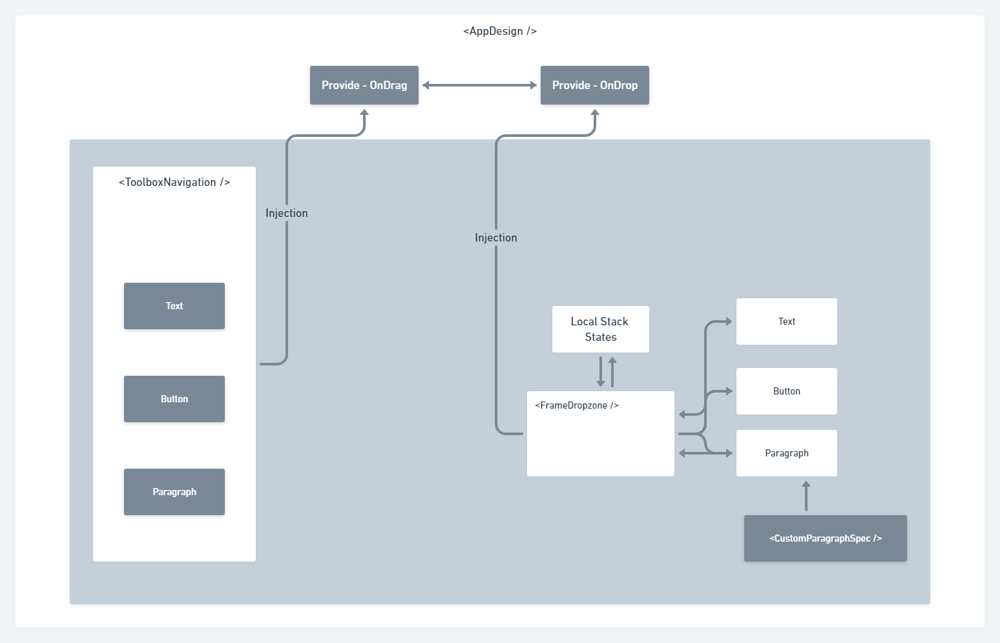

### Octadesk frontend test

Desenvolvido com [VueJS 3](https://v3.vuejs.org/) + [Typescript](https://www.typescriptlang.org/) + [Tailwind](https://tailwindcss.com/) + [Vite 2](https://vitejs.dev/)

### Instalação e preview
````bash
git clone https://github.com/lpj145/octa-vaga-front.git
npm i # yarn
npm run dev # yarn dev
````

### Limitações
Não funciona em telas touch :( eu preciso de mais tempo para fazer a adaptação aos eventos, no entanto poderia ter utilizado uma biblioteca como o [interactjs](https://interactjs.io/)
no entanto isso não mostraria habilidades em fazer os calculos matematicos necessários para se manipular o DOM, além do que criaria um tremendo shortcut que não mostraria nada sobre mim.

A ideia foi não deixar a estrutura muita complexa, mostrar que mesmo apenas funcional, bastante coisas no vue 3 mudaram
para melhor (e muiito) como uma imagem vale mais que mil palavras eu fiz uma pra representar de maneira simplória o funcionamento.



A ideia nessa solução, foi ser bem especifico com vários componentes fazendo coisas bem pontuais, então lendo o nome deles
já é bem sugestivo.

``AppDesign`` - container de todo o resto, ele quem possuí o control de estados e uma interação entre quaisquer
que sejam nossos componentes filhos.

``ToolboxNavigation`` - Um navegador que implementar alguns outros componentes para arrastar e soltar, recebe por injeção
uma função para o drag, onde quem controla os estados e componente a partir dai é o AppDesign.

``FrameDropzone`` - Um lugar "box" onde soltamos componentes dentro dela, podemos ter esse mesmo component na navegação
lateral e não teríamos problemas nenhum, outros dentro dele mesmo, e controlar cada uma seu mundo muito espeficiamente,
ele possui um registrador interno, lembrando um pouco do ASM rsrsrs, onde se aloca o componente passado, coordenadas dele,
e um id auto gerado não iterável para melhoria de desempenho.

O resto dos componentes são auto identificáveis, onde temos algumas separações de responsabilidades. Cada componente
no seu mundo sabe muito bem o que precisa fazer, os tipos **TS** estão cruzados de forma proposital, para deixar claro
no que realmente estamos mexendo, com a ajuda da IDE ficou molesinha mexer.

Essa abordagem além de diminuir a complexidade, facilita e gera desempenho.

Para nomear parágrafos e botões fiz uma diretiva ``EditableContent`` onde parecido com o SO dois clicks lhe da a possibilidade
de renomear o texto encontrando ali, no entanto é necessário fazer um esforço para fazer o cursor funcionar direito, então é necessário
realizar três clicks no momento.

### Arquitetura do código
Separei o código naquilo que dentro do problema proposto, considerei **interface** (nosso) - **app** (aquilo que atende as necessidades do cliente),

Temos uns helpers marotos para nos ajudar em alguns cálculos também que se dividem nas duas frentes interface e app.

### Testes
Como meu tempo está bem corrido não consegui implementar testes(desculpas ruins essa), mas é porque realmente ta, o Jest resolveria fácil isso
até porque como estamos falando de camadas "domavéis" na aplicação e as facilidades que a V3 trouxe, testar isso não seria algo complexo.
